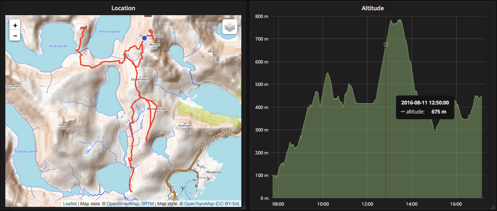
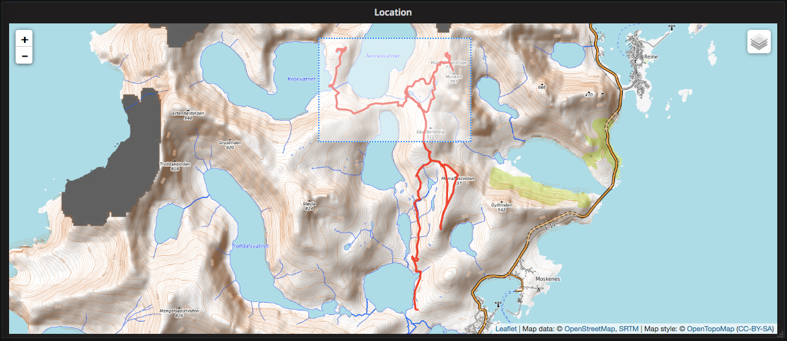
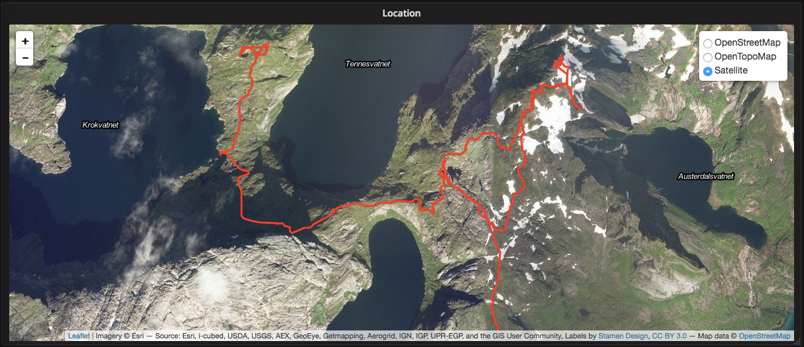

TrackMap Panel for Grafana
==========================
A panel plugin for [Grafana](https://grafana.com/) that visualizes GPS points as a line on an
interactive map.

This plugin is written in **React + TypeScript** using the modern Grafana plugin SDK (it replaced the
old AngularJS-based implementation, which was removed in Grafana 10).

Features
--------
- Places a dot on the map at the position of the vehicle for the time currently under the cursor as
  you hover over other panels (crosshair). Requires *shared crosshair* to be enabled on the dashboard.
- Zoom to a range of points by drawing a box with Shift-click and drag (also refines the dashboard
  time range to the selected points).
- Multiple map backgrounds: [OpenStreetMap](https://www.openstreetmap.org/),
  [OpenTopoMap](https://opentopomap.org/), and [Satellite imagery](https://www.esri.com/).
- Track segments are coloured by autopilot state (blue = Autopilot / TACC, red = manual driving),
  with an option to use a single custom colour instead.
- Optional pins for points of interest (supercharger / AC charger / parking) with popup text.
- Track, point and map options can be customized in the panel editor.

Requirements
------------
- Grafana **>= 10.0**
- The ability to load unsigned third-party plugins (set `GF_PLUGINS_ALLOW_LOADING_UNSIGNED_PLUGINS`
  if needed).

Screenshots
-----------




Data format
-----------
The plugin accepts GPS data in one of two formats.

### 1. Table format (recommended)
A single query that returns one row per GPS sample. The columns are mapped by name (or by position
if not recognized). The expected/recommended columns:

| Column       | Description                                      |
|--------------|--------------------------------------------------|
| `time_sec`   | Timestamp (column 0 by default)                  |
| `lat`        | Latitude  (detected by name, else column 1)      |
| `lng` / `lon`| Longitude (detected by name, else column 2)      |
| `type`       | Optional pin type (1..4, else no pin)            |
| `text`       | Optional popup text for the pin                  |
| `ap`         | Optional autopilot flag (1 = autopilot)          |

Example for a MySQL/MariaDB data source:
```sql
SELECT
  $__time(datum) AS time_sec,
  lat,
  lng,
  0 AS type,
  NULL AS text,
  ap
FROM pos
WHERE $__timeFilter(datum)
ORDER BY time_sec ASC
```

### 2. Series format
Two (optionally three) time-series queries, returned by Grafana as separate series. The order of the
queries matters: latitude first, then longitude, then (optionally) a third series for the pin type.

```
A: SELECT $__time(timestamp) AS time, "latitude"  AS value FROM location WHERE $__timeFilter(timestamp) ORDER BY timestamp ASC
B: SELECT $__time(timestamp) AS time, "longitude" AS value FROM location WHERE $__timeFilter(timestamp) ORDER BY timestamp ASC
```

Configuration
-------------
All options are available in the **Panel editor → Options**:

- **Max data points** – not applied on the table format (all returned rows are drawn).
- **Max data point time delta** – in seconds; `0` disables. Starts a new track when the gap between
  two consecutive points is larger than this value.
- **Auto zoom** – automatically fit the map to the data.
- **Zoom with scroll wheel**
- **Default map style** – `OpenStreetMap`, `OpenTopoMap`, or `Satellite`.
- **Show layer changer** – let viewers switch the map style.
- **Color by autopilot state** – colour segments red/blue by the `ap` flag (otherwise **Line color** is used).
- **Line color / Point color** – custom colours.
- **Field names (table format)** – override the column names used for time, latitude, longitude,
  type, text and autopilot. Leave empty to use auto-detection / column position.
- **Use table format** – force single-frame (table) parsing if auto-detection is not appropriate.

Crosshair (hover dot)
----------------------
To show the vehicle's position dot while hovering over neighboring panels, enable **shared crosshair**
on the dashboard: `Dashboard settings → Tooltip / Cursor → Shared crosshair`. This is stored in the
dashboard JSON as `"graphTooltip": 1`. Without it, graph panels do not emit hover events.

Build
-----
The plugin is built with the official [@grafana/create-plugin](https://grafana.com/developers/plugin-tools/)
tooling (webpack + swc). Requires Node.js >= 20.

```
npm install
npm run build
typecheck   # optional: npm run typecheck
```

This builds the source into the `dist` folder for Grafana to load.

Development / watch mode:
```
npm run watch
```

Deploying to a Dockerized Grafana
---------------------------------
`CopyToDocker - NET8.bat` copies the local `dist` folder into the Grafana container's plugin
directory and restarts Grafana:

```
docker cp ./dist/. teslalogger-grafana:/var/lib/grafana/plugins/pR0Ps-grafana-trackmap-panel/dist/
docker restart teslalogger-grafana
```

The script clears the target directory first and copies the contents directly into `dist` (it does
not create a nested `dist/dist`, which Grafana would ignore).
