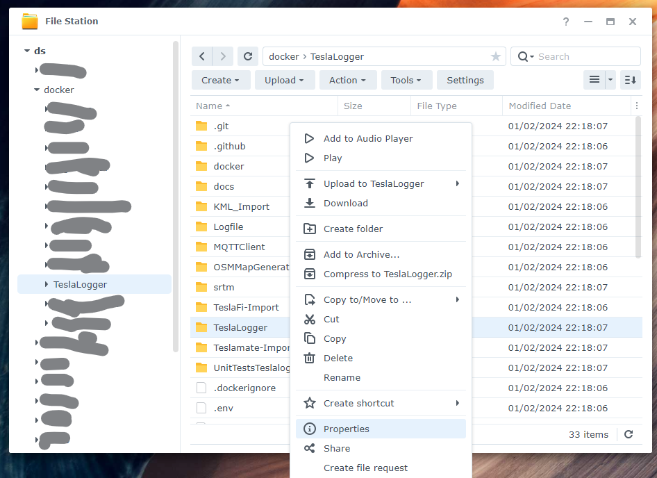

# Teslalogger Docker Setup on Synology NAS - DSM 7

Installation instructions for Synology NAS on DSM 7.2-64570 Update 1

I've had a hard time to get this to work, which in the end had mostly todo with ACLs as this is mostly hidden in an SSH session. But in the end I got it to work. I hope this helps someone else who wants to install this on DSM 7+. I wish I could set it up a bit more secure, as I've given read/write permissions to everyone, but with mixed host/containerized UIDs/GIDs it's very hard to tie it down. So, massive disclaimer that this is not the most secure method, but it works.

Open an SSH session to your Synology NAS and execute the following commands (assumes you already have Container Manager installed and use /volume1, please amend if different):

```
sudo -i
cd /volume1/docker
git clone https://github.com/bassmaster187/TeslaLogger
cd TeslaLogger/TeslaLogger
mkdir GrafanaDashboards && mkdir GrafanaDB
```

Because DSM uses ACLs, the file permissions are a bit more complicated than the standard Linux permissions. The easiest way to make the changes is by using File Station in the Synology Web Portal.
- Open File Station
- Browse to /volume1/docker/TeslaLogger
- Inside this directory, right click on the second TeslaLogger directory and select Properties from the menu



- In the Properties popup, select the Permissions tab
- Click on the Create button to open the Permissions Editor


- In the User or Group dropdown, select Everyone
- In the Permission area, tick the Read and the Write tickbox (all sub items will be ticked)
- Click the Done button


- Back on the Properties popup, click on the Save button

Close File Station and open Container Manager

- Select the Project side tab and click the Create button


On the Create Project wizard:
- give your project a name, e.i: teslalogger
- Select the path: /volume1/docker/TeslaLogger
- It will detect this already has a docker-compose.yml file, so select to use the existing one and press ok
	


- Optionally change the TZ= timezones (4 instances)
- Press Next
- Press Next again
- Press Done
	
The containers will boot up. You'll see that the database container will use a bit more resources for a while. It only does that at first boot and the other containers won't boot properly until this is finished. Give it a little time until the CPU for all containers are low. If you have any first time start-up issues, then go into the Action dropdown and select Restart.


These are the URLs you can use, replace "host" with your own NASs hostname:

- Admin: http://host:8888/admin/
- Grafana: http://ds:3000/

## Update on Synology with Task Scheduler
1. Login to your DSM Dashboard
2. Open `Control Panel` and select `Task Scheduler` on the left
3. `Create` -> `Scheduled Task` -> `User-defined script`
4. `General` Tab:
   - Name: `Update Teslalogger`
   - User: `root`
   - Untick `Enabled`
5. `Schedule` Tab:
   - Tick `Run on the following date`
   - Repeat: `Do not repeat`
6. `Task Settings` Tab:
   - Tick `Send run details by email`
   - Email: Your Email
   - User-defined script:
     ```
     cd /volume1/docker/TeslaLogger/
     docker-compose stop
     git fetch
     git reset --hard origin/master
     git checkout origin/master -- docker-compose.yml
     git checkout origin/master -- TeslaLogger/GrafanaConfig/datasource.yaml
     docker-compose build
     docker-compose up -d
     chmod 777 TeslaLogger/GrafanaDB
     ```
7. Hit `Ok`
8. Select `Update Teslalogger` task
9. Hit `Run` or right-click `Run`
